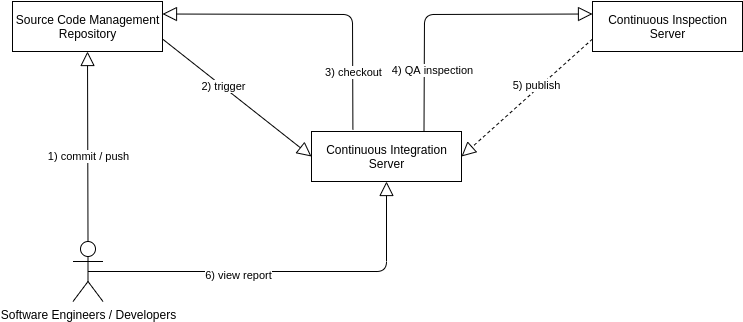
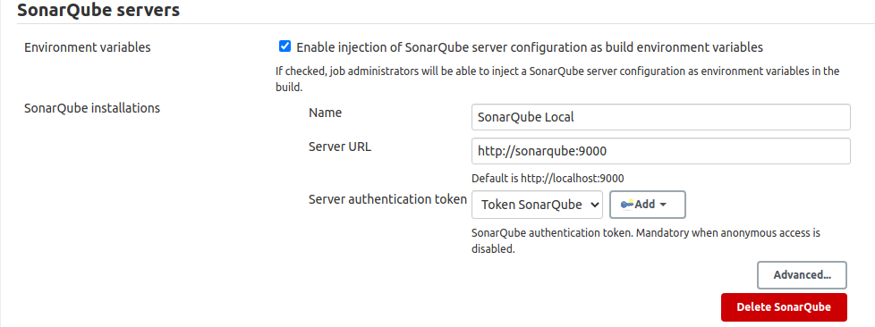
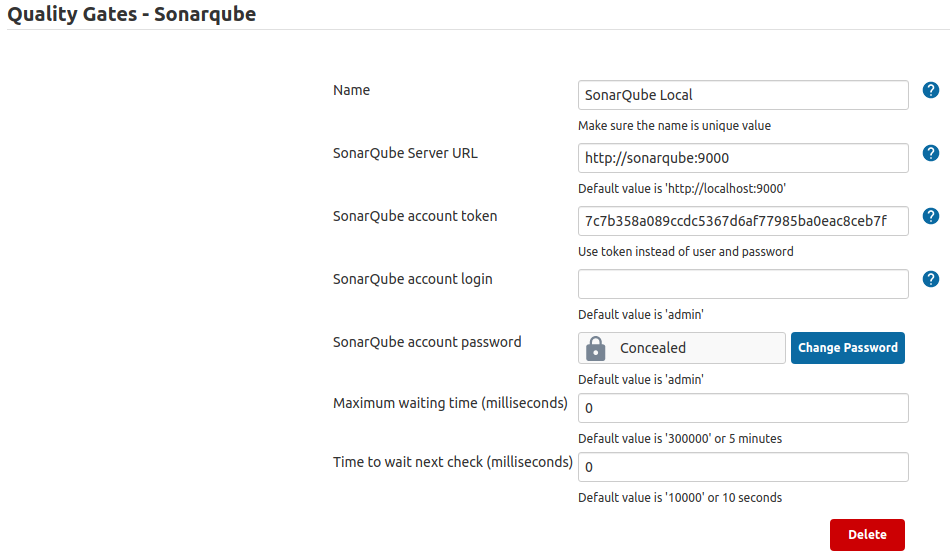

# CICD System

Continuous Integration (**CI**) - Continuous Deployment (**CD**) System.

### Infrastructure Diagram



### SonarQube

Administrator console is available to the following url:

`http://<MACHINE_IP>:9000`
	
Administrator credentials:

`USERNAME: admin`

`PASSWORD: admin`

Access token:

`jenkins: 7c7b358a089ccdc5367d6af77985ba0eac8ceb7f`

Maven goal:

```
mvn sonar:sonar
-Dsonar.host.url=http://sonarqube:9000
-Dsonar.login=7c7b358a089ccdc5367d6af77985ba0eac8ceb7f
```

### Jenkins

To show the initialAdminPassword, run command:

`docker exec <CONTAINER_ID> cat /var/jenkins_home/secrets/initialAdminPassword`

Admin console at following url:

`http://<MACHINE_IP>:8080`
	
Jenkins user:

`USERNAME: admin`

`PASSWORD: admin`

#### Maven Settings

For proxy definition, mirrors or others settings update [settings.xml](jenkins/settings.xml) file under `jenkins/` folder.

#### Plugins to install

- SonarQube Scanner for Jenkins
- Sonar Quality Gates Plugin

#### Define credentials

Go to `Manage Jenkins` > `Manage Credentials` > `Global credentials (unrestricted)` and define:

| Name | Type |
|-------|------|
|SONARQUBE_TOKEN|Secret text|
|GIT_CREDENTIAL|Username with password|

### Configure SonarQube and Quality Gate

Go to `Manage Jenkins` > `Configure System`:



#### SonarQube Quality Gate configuration



## Run infrastructure

`docker-compose up --build`

with `-d` option run all in detached mode
